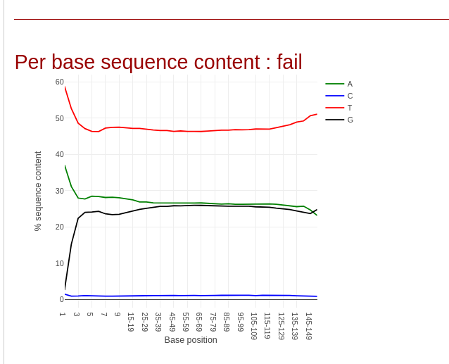
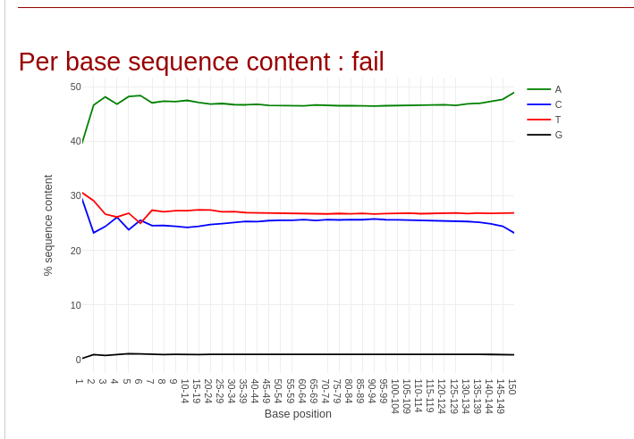

# WGBS: Bisulfite Sequencing Pipeline

**Platform:** Galaxy Europe (usegalaxy.eu)  
**Reference:** Lin et al. (2015), PLOS ONE - Breast Cancer Methylomes  
**Tutorial:** Galaxy Training Network - DNA Methylation data analysis

---

## Overview

This module documents a whole genome bisulfite sequencing (WGBS) pipeline run entirely in Galaxy Europe. The analysis follows the Galaxy Training Network methylation-seq tutorial and is based on a published dataset from Lin et al. (2015), which profiled DNA methylation across normal breast tissue, benign fibroadenoma, and invasive ductal carcinoma samples.

**Pipeline steps covered:**
1. Data upload
2. Quality control (Falco)
3. Bisulfite-aware alignment (bwameth)
4. Methylation bias check (MethylDackel)
5. Methylation extraction (MethylDackel)
6. CpG island profile - subset sample
7. Methylation profile - all six samples
8. Differentially methylated region (DMR) detection (Metilene)

---

## Dataset

A small paired-end WGBS subset from Lin et al. (2015) is used for QC, alignment, and methylation extraction. For visualization and DMR detection, precomputed bedGraph files for all six samples are loaded directly from Zenodo.

| Sample ID | Tissue Type |
|-----------|-------------|
| NB1 | Normal breast tissue |
| NB2 | Normal breast tissue |
| BT089 | Fibroadenoma (benign) |
| BT126 | Invasive ductal carcinoma |
| BT198 | Invasive ductal carcinoma |
| MCF7 | Breast adenocarcinoma cell line |

**Source:** https://zenodo.org/record/557099

---

## Pipeline Steps

### 1. Data Upload

Raw paired-end reads (`read1_breast_subset.fastq`, `read2_breast_subset.fastq`) were loaded into Galaxy via Paste/Fetch Data from Zenodo. Galaxy auto-detected the format as `fastq`.

---

### 2. Quality Control - Falco 1.2.4

Both read files were run through Falco simultaneously with default settings.

#### Read 1 QC

#### Read 2 QC

**Interpretation:**  
Both reads are flagged as "fail" for per-base sequence content,this is **expected** for bisulfite-treated data, not a quality problem. In Read 1, T dominates (~50%) with C nearly absent (~0–1%) across all 150 positions. This is the classic bisulfite conversion signature: every unmethylated cytosine is converted to uracil during bisulfite treatment and subsequently read as T, so depleted C confirms the conversion worked correctly. Read 2 shows A dominant (~47–48%), which is consistent with the complementary strand of bisulfite-converted DNA.

---

### 3. Bisulfite Alignment - bwameth 0.2.7

A standard short-read aligner cannot be used directly on bisulfite data because it cannot distinguish an original T from a bisulfite-converted C. bwameth uses a three-letter alignment strategy: both reads and the reference genome are virtually converted in silico before alignment, preserving methylation information in the output BAM.

| Parameter | Value |
|-----------|-------|
| Reference genome | Human hg38full (built-in Galaxy index) |
| Library type | Paired-end |
| Output | Sorted BAM file |

---

### 4. Methylation Bias - MethylDackel 0.5.2

The bias plot checks whether CpG methylation levels are consistent across all positions along a read. A drop or spike at the 5′ or 3′ ends would indicate end-repair artifacts or incomplete bisulfite conversion, which would require positional trimming before extraction.

**Interpretation:**  
The original top strand shows stable CpG methylation between 70–75% across all 150 read positions for both read pairs (#1 salmon, #2 teal). The MethylDackel-suggested trim parameters `--OT 0,145,6,149` indicate only a minimal 5-position trim at the very end of read 2, reflecting negligible bias. No meaningful positional artifacts were detected, so no trimming was applied for extraction.

---

### 5. Methylation Extraction - MethylDackel 0.5.2

Methylation fractions were extracted in CpG-only mode with per-cytosine merging enabled. The output is a bedGraph file where each row gives the genomic coordinates of a CpG site and its methylation fraction (0–1).

---

### 6. CpG Island Profile - Subset Sample

The extracted bedGraph was converted to bigWig (Wig/BedGraph-to-bigWig 1.9.1) after setting the genome build attribute to hg38. The CpG islands BED file was imported from Zenodo. `computeMatrix` was run in reference-point mode (±1 kb around TSS) followed by `plotProfile`.

**Interpretation:**  
The single-sample profile shows the characteristic TSS-centered hypomethylation dip: methylation falls from ~0.6–0.65 at flanking regions to ~0.30–0.35 at the TSS, then partially recovers in the gene body. This reflects the well-established pattern of promoter hypomethylation at actively transcribed genes. The noisiness of the curve is expected given the small subset size used.

---

### 7. Methylation Profile - All Six Samples

The six precomputed UCSC-format bedGraph files were assembled into a Galaxy collection, converted to bigWig, and run through the same `computeMatrix`/`plotProfile` pipeline.

**Interpretation:**  
All six samples show the expected TSS-centred hypomethylation pattern. However, there is a clear tissue-type stratification:

- **NB1, NB2 (normal)** - deepest TSS dip (~0.28–0.33), indicating the lowest promoter methylation and the most transcriptionally permissive chromatin state.
- **BT089, BT126 (fibroadenoma / IDC)** - intermediate TSS dip.
- **MCF7, BT198 (cancer cell line / IDC)** - flattened or elevated TSS methylation (~0.38–0.40 at TSS minimum), consistent with the aberrant promoter hypermethylation that silences tumor suppressor genes in breast cancer.

This ordering is consistent with the findings of Lin et al. (2015).

---

### 8. DMR Detection - Metilene 0.2.6.1

Differentially methylated regions were detected between:
- **Group 1:** NB1, NB2 (normal breast tissue)
- **Group 2:** BT198 (invasive ductal carcinoma)

Ensembl-format bedGraphs (without the `ucsc` suffix) were used because Metilene requires Ensembl chromosome naming.

#### Normal vs Cancer Mean Methylation per DMR

**Interpretation:**  
Each point represents one DMR; the x-axis is mean methylation in the normal group (NB1 + NB2) and the y-axis is mean methylation in BT198 (cancer). The two main clusters visible are:

- **Dense lower-left cluster (cancer hypomethylation):** A large mass of DMRs with low methylation in both groups but shifted downward, representing global hypomethylation of repetitive elements and gene bodies, a hallmark of cancer.
- **Points above the diagonal (cancer hypermethylation):** A dispersed set of DMRs with higher methylation in cancer than in normal tissue. These correspond to CpG island promoters of tumor suppressor genes that become aberrantly silenced in IDC which is the classic cancer epigenetic signature.

The asymmetry of the scatter (more points below the diagonal than above) confirms that global hypomethylation predominates in BT198, while promoter-specific hypermethylation affects a smaller but biologically important subset of loci.

---

## Tools and Versions

| Tool | Version |
|------|---------|
| Falco | 1.2.4 |
| bwameth | 0.2.7 |
| MethylDackel | 0.5.2 |
| Wig/BedGraph-to-bigWig | 1.9.1 |
| computeMatrix (DeepTools) | 3.5.4 |
| plotProfile (DeepTools) | 3.5.4 |
| Metilene | 0.2.6.1 |

---

## References

- Lin, I.-H. et al. (2015). Hierarchical Clustering of Breast Cancer Methylomes Revealed Differentially Methylated and Expressed Breast Cancer Genes. *PLOS ONE* 10(2): e0118453. https://doi.org/10.1371/journal.pone.0118453
- Galaxy Training Network: DNA Methylation data analysis. https://training.galaxyproject.org
